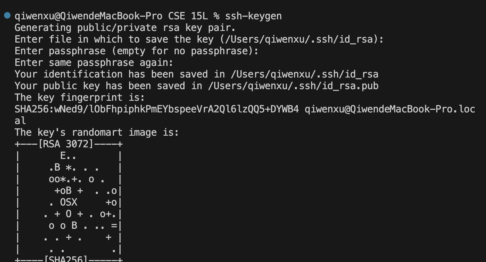
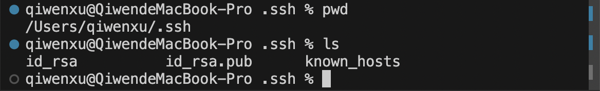
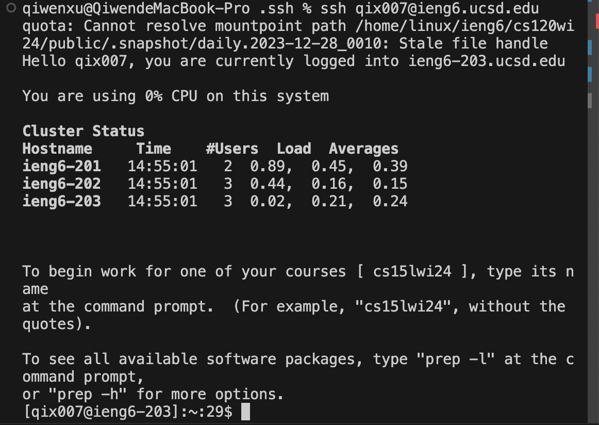

# week 3 lab report
## Part 1
### ChatServer Code
```
import java.io.IOException;
import java.net.URI;
import java.util.ArrayList;

class Handler implements URLHandler {
    ArrayList<String> messages = new ArrayList<String>();
    ArrayList<String> users = new ArrayList<String>();

    public String handleRequest(URI url) {
        if (url.getPath().equals("/")) {
            if (!messages.isEmpty()) {
                return toString(users,messages);
            } else {
                return "No messages yet";
            }
        } else if (url.getPath().contains("/add-message")) {
            String query = url.getQuery();
            String[] parameters = query.split("&");
            String message = "";
            String user = "";

            for (String parameter : parameters) {
                String[] keyValue = parameter.split("=");
                if (keyValue.length == 2) {
                    if (keyValue[0].equals("s")) {
                        message = keyValue[1].replace("+", " "); // replace '+' to space for the message
                    } else if (keyValue[0].equals("user")) {
                        user = keyValue[1];
                    }
                }
                messages.add(message);
                users.add(user);

            }
            return toString(users,messages);
        } else {
            return "404 Not Found!";
        }
    }

    public static String toString(ArrayList<String> l1, ArrayList<String> l2) {
        String result = "" ;
        for (int i = 0; i < l1.size(); i++) {
            result += l1.get(i) + ": " + l2.get(i) + "\n";
        }
        return result;
    }
}

class ChatServer {
    public static void main(String[] args) throws IOException {
        if (args.length == 0) {
            System.out.println("Missing port number! Try any number between 1024 to 49151");
            return;
        }

        int port = Integer.parseInt(args[0]);

        Server.start(port, new Handler());
    }
}

```
### After `/add-message?s=Hello&user=jpolitz`


For this screenshot, there are the methods my code called:

`handleRequest(url)` - the argument is `url`

`url.getPath().contains("/add-message")`- there is no argument for .getPath

`url.getPath().contains("/add-message")`- the argument of .contains is "/add-message"

`url.getQuery()` - not argument 

`query.split("&")` - argument is "&"

`parameter.split("=")` - argument is "="

`keyValue[0].equals("s")` - argument is "s"

`keyValue[1].replace("+", " ")` - argument are "+" and " "

`messages.add(message)` - argument is `message`

`eyValue[0].equals("user")` - argument is "user"

`messages.add(message)` - argument is `messages`

`users.add(user)` - argument is `user`

`toString(users,messages)` - argument is `users` and `messages`

The value of the arraylist `messages` in the Handler class is [Hello]. The value of the arraylist `users` in the Handler class is [jpolitz]. 
`messages.add(message)` adds the `message` string to the field `message` in the Handler class, and `users.add(user)` adds the `user` string to the field `users`.

### After `/add-message?s=How are you&user=yash`


For this screenshot, there are the methods my code called:

`handleRequest(url)` - the argument is `url`

`url.getPath().contains("/add-message")`- there is no argument for .getPath

`url.getPath().contains("/add-message")`- the argument of .contains is "/add-message"

`url.getQuery()` - not argument 

`query.split("&")` - argument is "&"

`parameter.split("=")` - argument is "="

`keyValue[0].equals("s")` - argument is "s"

`keyValue[1].replace("+", " ")` - argument are "+" and " "

`messages.add(message)` - argument is `message`

`eyValue[0].equals("user")` - argument is "user"

`messages.add(message)` - argument is `messages`

`users.add(user)` - argument is `user`

`toString(users,messages)` - argument is `users` and `messages`

The value of the arraylist `messages` in the Handler class is [Hello, How are you]. The value of the arraylist `users` in the Handler class is [jpolitz, yash]. 
`messages.add(message)` adds the `message` string to the field `message` in the Handler class, and `users.add(user)` adds the `user` string to the field `users`.

## Part 2
The absolute path to the private key is `/Users/giwenxu/.ssh/id_rsa`. 
The absolute path to the public key is `/Users/qiwenxu/.ssh/id_rsa.pub`.

The pictures of the paths of both key.




The picture of log into the ieng6 account without being asked for a password.



## Part 3
I learn that how to set up the SSH keys to access account easily. The `scp` command copies files or directories between a local and a remote system or between two remote systems. The `mkdir` command creates new directories. The `man` command displays the manual pages for various commands, programs, and system functions.
