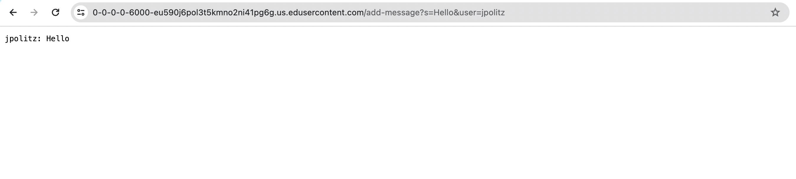
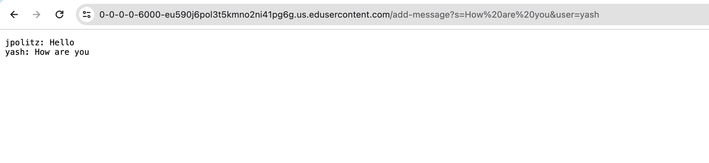

# week 3 lab report
## Part 1
After `/add-message?s=Hello&user=jpolitz`

For this screenshot, there are the methods my code called:
1. Integer.parseInt(args[0])
- This method takes a string argument and convert it into integer.
- args[0] is the argument passed into the medthod. In this method, there are no relevant fields of a class involved. The code only deals with parsing the string argument.
- This method does not change any relevant fields of a class because it uses to parse a command-line argument into an integer.
2. Server.start(port, new Handler())
- This method takes a URLHandler object and a port number. This method creates request entrypoint and starts a server.
- new Handler() and a port number, which gets from args[0], are the argument passed into the medthod.
- The server creates using the port number

For this screenshot, there are the methods my code called:
`url.getQuery()` - not argument
`query.split("&")` - argument is "&"
`parameter.split("=")` - argument is "="
`keyValue[0].equals("s")` - argument is "s"
`keyValue[1].replace("+", " ")` - argument is "s"
`messages.add(message)` - argument is `message`
`eyValue[0].equals("user")` - argument is "user"
`messages.add(message)` - argument is `message`
`users.add(user)` - argument is `user`
`toString(users,messages)` - argument is `user` and `message`

After `/add-message?s=How are you&user=yash`

